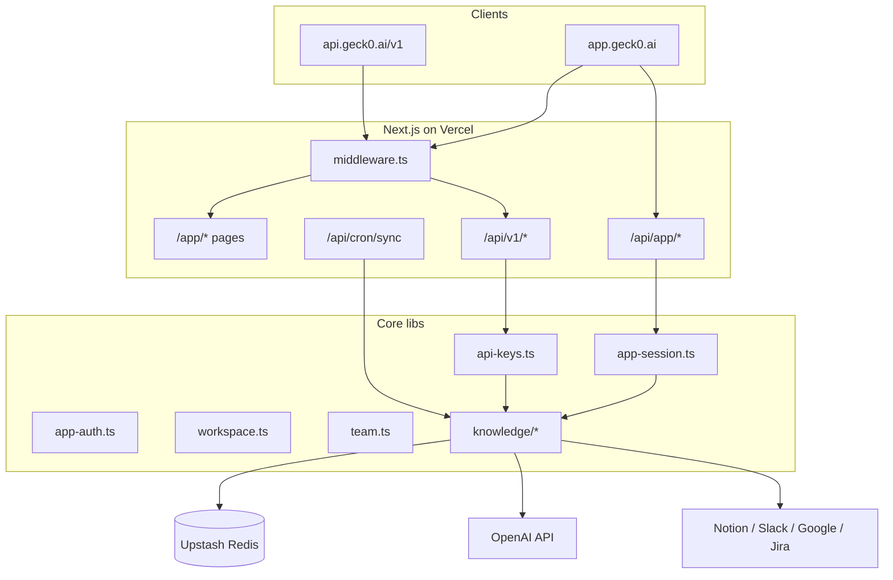

# geck0 — Full handoff for Claude (or any next agent)

**Last updated:** 2026-05-31  
**Purpose:** Paste this entire file into Claude so it has full context to continue work without asking the user basic questions.

---

## 1. What this project is

**geck0** is a B2B “company knowledge” product: connect Notion/Slack/Drive/Jira (or upload docs), then Q&A with citations, knowledge graph, and insights.

| Surface | URL | Role |
|---------|-----|------|
| Marketing / waitlist | https://geck0.ai | Landing, pricing, blog, contact, Stripe waitlist |
| Beta app | https://app.geck0.ai/app | Logged-in product (dashboard, Q&A, graph, integrations) |
| Product API | https://api.geck0.ai/v1 | Bearer `gk_` API keys |

**User intent (from prior sessions):** Ship real product first; Toss Payments later (merchant not ready). Maximize completion without asking the user questions. Test account: **hello@geck0.ai**.

---

## 2. Repository & deploy

| Item | Value |
|------|--------|
| **Local path** | `c:\Users\Administrator\Downloads\geck0_complete_package\geck0-landing` |
| **GitHub** | `https://github.com/christoughr/geck0-landing` |
| **Branch** | `master` |
| **Vercel project** | `onlyus/geck0-landing` |
| **Stack** | Next.js 14.2.35, TypeScript, Tailwind, App Router |
| **Data** | Upstash Redis (KV) for workspaces, knowledge, sessions, API keys |
| **Deploy** | `npx vercel deploy --prod --yes` (Git push also triggers deploy) |

### Git commit author (required)

Vercel Hobby blocks commits from `geck0-bot` / Cursor co-author. Always commit as:

```powershell
$env:GIT_AUTHOR_EMAIL='christoughr@gmail.com'
$env:GIT_COMMITTER_EMAIL='christoughr@gmail.com'
git commit -m "..."
```

**Do not** change git config. **Do not** commit unless user asks.

### Recent commits (newest first)

```
b5a89a3 fix: daily cron for Vercel Hobby
908cb38 feat: OAuth connectors, team RBAC, vector RAG, public API v1
8da2bf5 feat: workspace knowledge base, RAG Q&A, Notion sync, uploads
c0c9d7a feat: polish beta app layout across all workspace pages
35ce86a fix: app login UX, redirects, and full test suite
5620c9b fix: redirect app.geck0.ai root to /app gate
08a4c4a feat: app.geck0.ai beta product and Toss billing scaffold
a58c16f feat: Stripe per-seat checkout, Bot Fight, billing honesty
```

---

## 3. Architecture (high level)



### Workspace model

- `workspaceIdFromEmail(email)` in `src/lib/workspace.ts`
- Company domains → `ws_company_com`
- Gmail/Yahoo → `ws_u_<hash>` (per-user workspace)

### Session

- Cookie: `geck0_app_session` (HMAC signed, 14 days)
- Production domain: `.geck0.ai` (works on both `geck0.ai` and `app.geck0.ai`)
- Secret: `APP_SESSION_SECRET` (fallback `ADMIN_API_KEY` — avoid long-term)

### Who can log in

1. `APP_BETA_OPEN=true` (dev only), or  
2. `BETA_ALLOWED_EMAILS` / `BETA_ALLOWED_DOMAIN`, or  
3. **Workspace team invite** (`src/lib/team.ts` — async `isAppEmailAllowed`)

---

## 4. App routes (protected under `src/app/app/(protected)/`)

| Path | Description |
|------|-------------|
| `/app` | Gate: email login + waitlist (Step 2 is NOT login) |
| `/app/dashboard` | Stats from KV |
| `/app/qa` | Q&A + history sidebar |
| `/app/graph` | SVG graph from indexed docs |
| `/app/insights` | Rule-based insights |
| `/app/settings/integrations` | Notion, Slack OAuth, Drive OAuth, Jira, upload |
| `/app/settings/team` | Invite/remove members |
| `/app/settings/api` | Create/revoke `gk_` API keys |

Shell: `AppProductShell.tsx` + `app-i18n.ts` nav.

---

## 5. API routes

### App (session cookie)

| Method | Path | Purpose |
|--------|------|---------|
| POST/DELETE | `/api/app/auth` | JSON login / logout |
| POST | `/api/app/auth/login` | Form POST login |
| GET | `/api/app/auth/google` | Google SSO start |
| GET | `/api/app/auth/google/callback` | Google SSO callback |
| POST | `/api/app/qa` | RAG Q&A |
| GET | `/api/app/history` | Q&A history |
| GET/POST/DELETE | `/api/app/knowledge` | List/upload/delete docs |
| GET/POST | `/api/app/connectors` | Connector status + actions |
| GET | `/api/app/workspace` | Dashboard stats |
| GET/POST | `/api/app/team` | Team list / invite / remove |
| GET/POST | `/api/app/api-keys` | API key CRUD |
| GET | `/api/app/oauth/slack` | Slack OAuth redirect |
| GET | `/api/app/oauth/slack/callback` | Slack OAuth callback |
| GET | `/api/app/oauth/google` | Drive OAuth redirect |
| GET | `/api/app/oauth/google/callback` | Drive OAuth callback |

### Public API v1 (Bearer `gk_…`)

| Method | Path | Auth |
|--------|------|------|
| GET | `/api/v1/health` | None |
| POST | `/api/v1/qa` | Bearer API key |
| GET | `/api/v1/knowledge` | Bearer API key |

`api.geck0.ai/v1/*` → middleware rewrites to `/api/v1/*` (see `middleware.ts`).

OpenAPI: `public/openapi-product.yaml`

### Cron

| Path | Schedule | Auth |
|------|----------|------|
| `/api/cron/sync` | `0 3 * * *` (daily — Vercel Hobby limit) | `Authorization: Bearer $CRON_SECRET` |

Re-syncs Notion/Slack/Drive/Jira for workspaces that have tokens.

### Marketing / billing (existing)

- `/api/subscribe`, `/api/contact`, `/api/health`
- `/api/checkout`, `/api/webhooks/stripe`
- `/api/billing/toss`, `/api/webhooks/toss` — **scaffold only** (no merchant keys)

---

## 6. Knowledge system (`src/lib/knowledge/`)

| File | Role |
|------|------|
| `store.ts` | KV: docs, chunks, connectors, OAuth tokens, embeddings, QA history |
| `chunk.ts` | Text chunking (~600 chars) |
| `embeddings.ts` | OpenAI `text-embedding-3-small`, cosine search |
| `search.ts` | Hybrid keyword + vector RAG; `synthesizeAnswer` via OpenAI |
| `seed.ts` | Demo docs on first workspace init |
| `notion.ts` | Notion search + block text |
| `slack.ts` | Slack OAuth channel history + JSON export import |
| `drive.ts` | Google Drive file export |
| `jira.ts` | Jira REST search |
| `graph.ts` | Nodes/edges from docs |
| `insights.ts` | Rule-based pulses |
| `index.ts` | `prepareWorkspace`, `answerWorkspaceQuery` |

**Q&A modes returned:** `openai-vector-rag`, `openai-rag`, `vector-rag`, `keyword-rag`, `no-results`

**On document upsert:** chunks saved + async `indexDocumentEmbeddings` if `OPENAI_API_KEY` set.

---

## 7. Environment variables (Vercel Production)

### Required for app product

```
APP_SESSION_SECRET=          # 32+ random chars
BETA_ALLOWED_EMAILS=christoughr@gmail.com,hello@geck0.ai
KV_REST_API_URL=             # Upstash
KV_REST_API_TOKEN=
```

### Strongly recommended

```
OPENAI_API_KEY=              # Better answers + vector embeddings
CRON_SECRET=                 # Cron auth
```

### OAuth (optional — UI works; OAuth needs these)

```
SLACK_CLIENT_ID=
SLACK_CLIENT_SECRET=
GOOGLE_CLIENT_ID=            # Also used for Google SSO login
GOOGLE_CLIENT_SECRET=
NOTION_INTERNAL_TOKEN=       # Optional server-wide Notion sync on first init
```

### Marketing (already configured in prod)

```
# Turnstile, Mailchimp, Resend, Sentry, Stripe keys — see docs/*.md
```

### Not set / deferred

```
# Toss merchant keys — user said personal/prep, defer
# Enterprise SSO beyond Google email login
```

---

## 8. User-facing gotchas (support)

1. **Use https://app.geck0.ai/app** — not `app.gecko.ai` (typo).
2. **Purple box “Step 1 · Beta login”** — not the waitlist form below.
3. **Session cookie** is on `.geck0.ai` — login works on both hosts.
4. **app.geck0.ai/** redirects to `/app` (`vercel.json` + `middleware.ts`).
5. Q&A on `app.geck0.ai` can **timeout on cold start**; `geck0.ai` path is more reliable in tests.

---

## 9. Testing

```bash
cd geck0-landing
npm run build
npm run test:all hello@geck0.ai
```

| Script | What |
|--------|------|
| `scripts/smoke-test.mjs` | Landing + health |
| `scripts/test-app-beta.mjs` | App auth, Q&A, pages |
| `scripts/test-all.mjs` | Runs all suites |

Last known: **7/8 suites** pass; occasional `app.geck0.ai` Q&A headers timeout on cold start. `geck0.ai` app beta **11/11**.

---

## 10. What is DONE vs NOT done

### Done (real code in prod)

- Beta app with auth (email + Google SSO + team invites)
- Workspace knowledge base in KV
- RAG Q&A with sources + history
- Graph + insights from real data
- Notion / Slack / Drive / Jira connectors (+ manual upload)
- Team RBAC (owner/admin/member)
- Public API v1 + API key UI
- Daily connector cron
- Stripe checkout scaffold, Toss scaffold
- Landing, Turnstile, Mailchimp, Resend contact

### Not done / needs external setup

| Item | Blocker |
|------|---------|
| Toss live payments | Merchant account / keys |
| Slack/Drive OAuth in prod | `SLACK_*`, `GOOGLE_*` env on Vercel |
| Vector search quality | `OPENAI_API_KEY` on Vercel |
| `api.geck0.ai` DNS | Must point to same Vercel project (middleware handles path) |
| Enterprise SSO (SAML) | Not built |
| Full multi-tenant admin | Not built |
| Public API rate limits per plan | Basic IP rate limit only |

---

## 11. Key docs in repo

| Doc | Topic |
|-----|--------|
| `docs/APP_BETA.md` | App login, env, routes |
| `docs/PRODUCT_V2.md` | Product feature list |
| `docs/LAUNCH_STATUS.md` | Live checklist |
| `docs/TOSS_SETUP.md` | Toss when ready |
| `docs/PAYMENTS.md` | Stripe vs Toss |
| `docs/STEP_BY_STEP.md` | User onboarding steps |
| `docs/VERCEL_DEPLOY.md` | Deploy notes |

---

## 12. Instructions for Claude

1. **Read this file first**, then `src/lib/knowledge/` and `src/lib/app-auth.ts` before large changes.
2. **User preference:** Do the work; don’t ask permission for every step. Don’t commit unless asked.
3. **Minimize scope** — match existing patterns; no over-engineering.
4. **After code changes:** `npm run build` → fix TS errors (watch `Set` iteration — use `Array.from`) → deploy if user wants prod updated.
5. **Product priority:** App + knowledge > Toss > enterprise extras.
6. **Test email:** `hello@geck0.ai` (on `BETA_ALLOWED_EMAILS`).

---

## 13. Copy-paste prompt for Claude

```
You are continuing work on geck0 (geck0-landing repo). Read docs/HANDOFF_FOR_CLAUDE.md in full.

Repo: github.com/christoughr/geck0-landing
Live: geck0.ai, app.geck0.ai, api.geck0.ai/v1
Stack: Next.js 14, Upstash KV, optional OpenAI.

The beta app has real workspace knowledge (RAG Q&A, Notion/Slack/Drive/Jira, team invites, API keys).
Toss payments are scaffolded but merchant keys are not set.

Continue from current master. Run build and test:all with hello@geck0.ai after changes.
Commit as christoughr@gmail.com only when user asks.
```

---

*End of handoff.*
